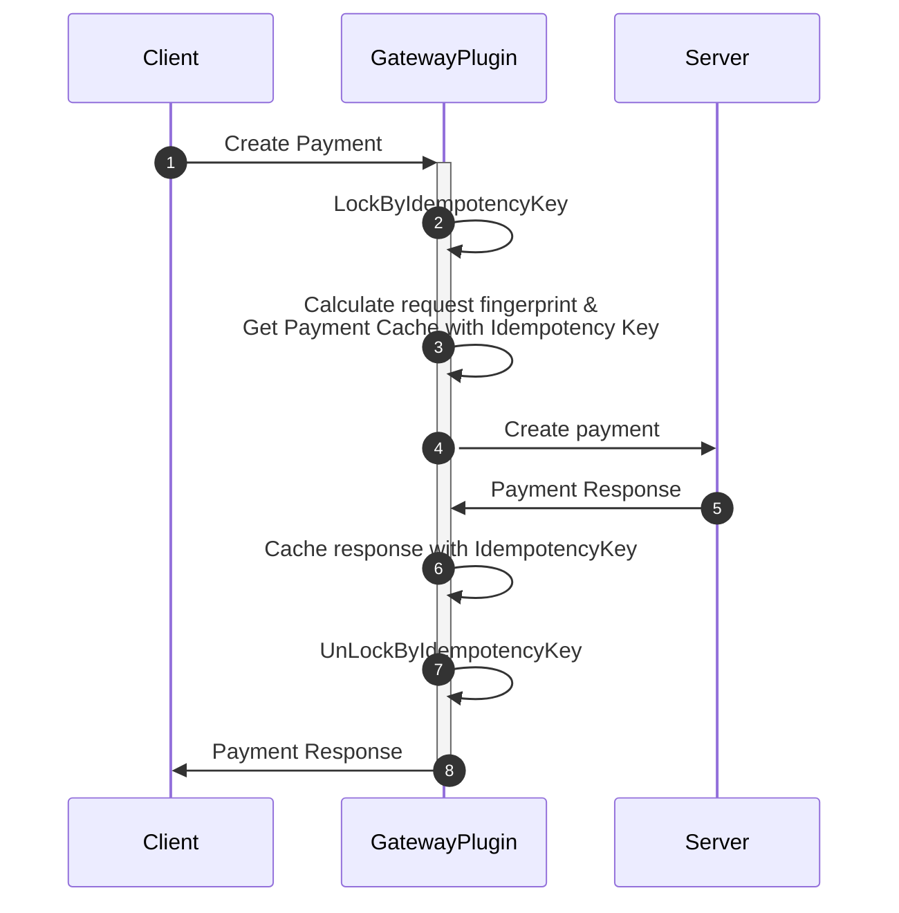
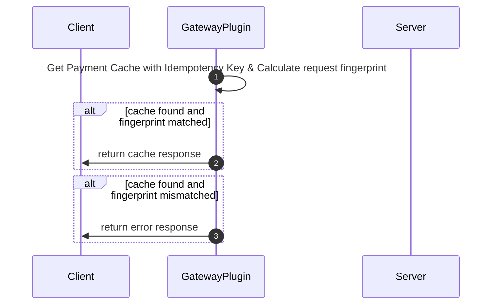

```mermaid
sequenceDiagram
    autonumber
    participant Client
    participant GatewayPlugin
    participant Server


    Client->>+GatewayPlugin: Create Payment
    GatewayPlugin->>GatewayPlugin: LockByIdempotencyKey
    GatewayPlugin->>GatewayPlugin: Calculate request fingerprint & <br> Get Payment Cache with Idempotency Key
    
    %% alt cache found and fingerprint matched
    %% GatewayPlugin->>Client: return cache response
    %% end
    
    %% alt cache found and fingerprint mismatched
    %% GatewayPlugin->>Client: return error response
    %% end

    GatewayPlugin->>Server: Create payment
    Server->>GatewayPlugin: Payment Response
    GatewayPlugin->>GatewayPlugin: Cache response with IdempotencyKey
    GatewayPlugin->>GatewayPlugin: UnLockByIdempotencyKey
    GatewayPlugin->>-Client: Payment Response
```

```mermaid
sequenceDiagram
    autonumber
    participant Client
    participant GatewayPlugin
    participant Server

    GatewayPlugin->>GatewayPlugin: Get Payment Cache with Idempotency Key & Calculate request fingerprint
    
    alt cache found and fingerprint matched
        GatewayPlugin->>Client: return cache response
    end
    
    alt cache found and fingerprint mismatched
        GatewayPlugin->>Client: return error response
    end
```