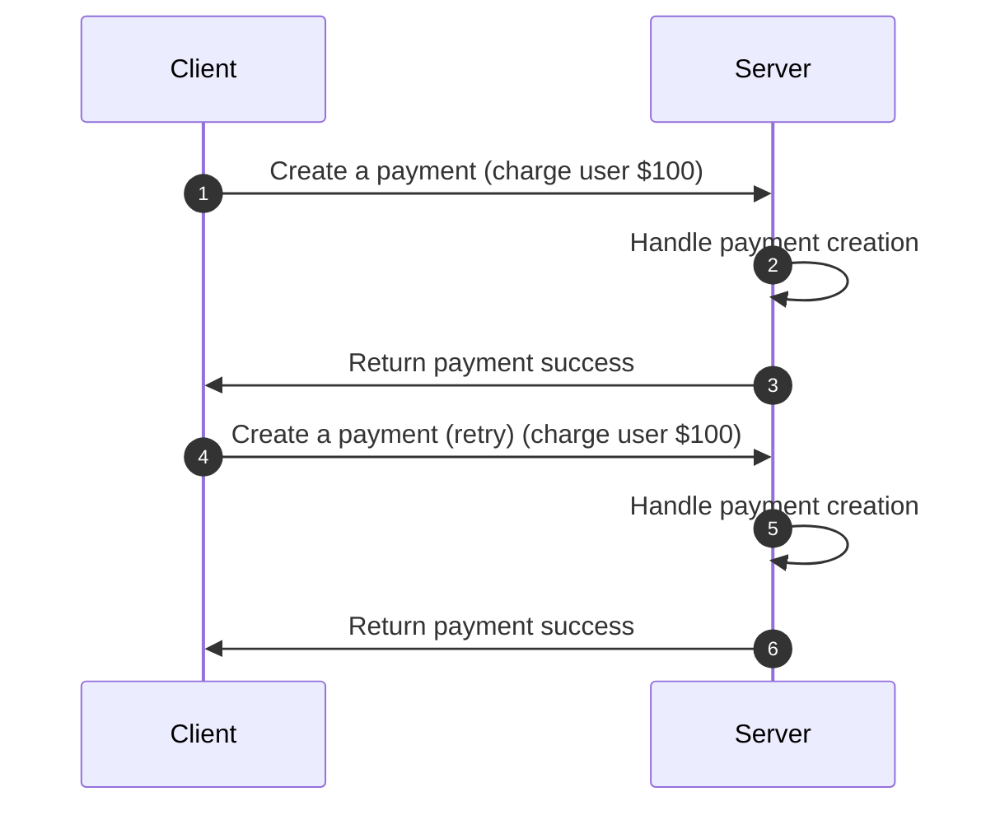

```mermaid
sequenceDiagram
    autonumber
    participant Client
    participant Server
    Client->>Server: Create a payment (charge user $100)
    Server->>Server: Handle payment creation
    Server->>Client: Return payment success

    Client->>Server: Create a payment (retry) (charge user $100)
    Server->>Server: Handle payment creation
    Server->>Client: Return payment success
```