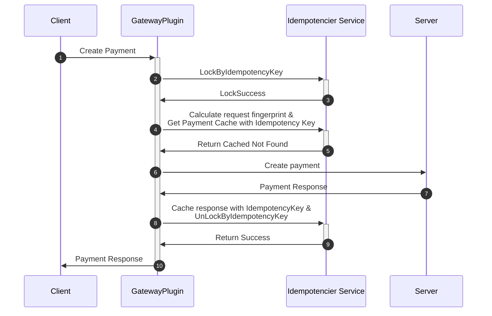
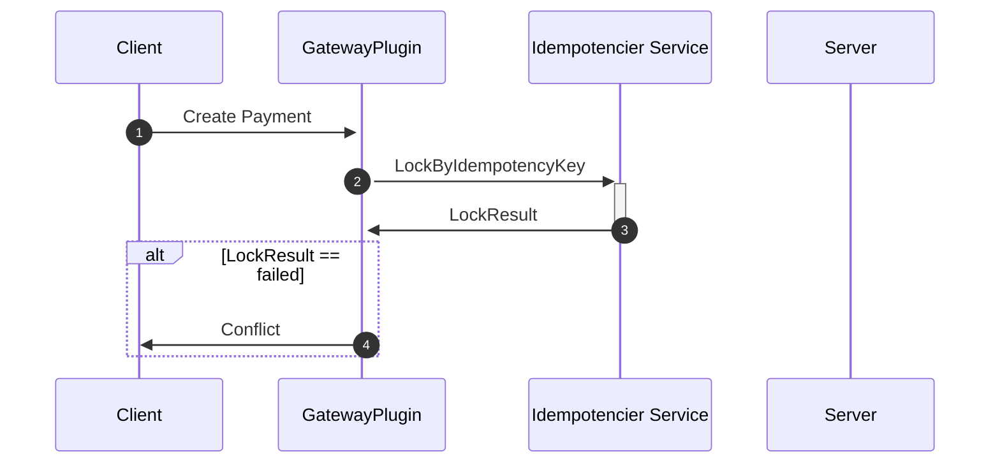
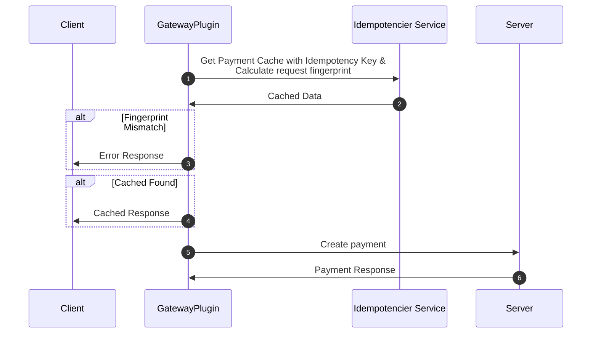
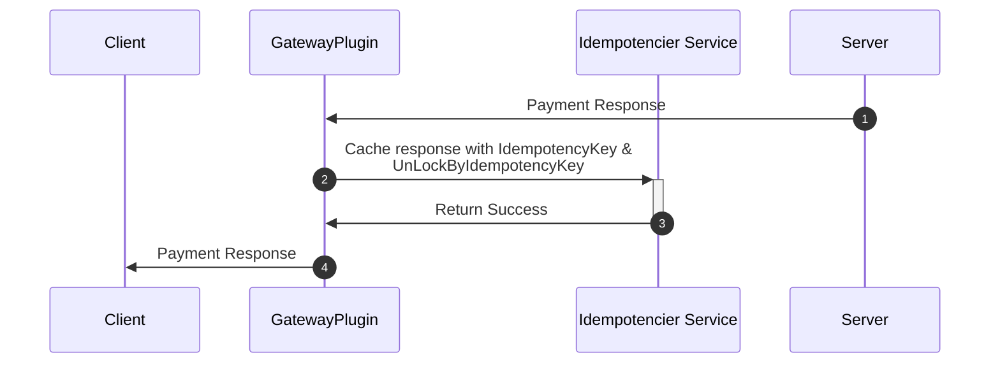

```mermaid
sequenceDiagram
    autonumber
    participant Client
    participant GatewayPlugin
    participant Idem as Idempotencier Service
    participant Server

    Client->>+GatewayPlugin: Create Payment
    GatewayPlugin->>+Idem: LockByIdempotencyKey
    Idem->>-GatewayPlugin: LockSuccess

    GatewayPlugin->>+Idem: Calculate request fingerprint &<br> Get Payment Cache with Idempotency Key 
    Idem->>-GatewayPlugin: Return Cached Not Found

    GatewayPlugin->>Server: Create payment
    Server->>GatewayPlugin: Payment Response
    GatewayPlugin->>+Idem: Cache response with IdempotencyKey &<br> UnLockByIdempotencyKey
    Idem->>-GatewayPlugin: Return Success
    GatewayPlugin->>-Client: Payment Response
```

```mermaid
sequenceDiagram
    autonumber
    participant Client
    participant GatewayPlugin
    participant Idem as Idempotencier Service
    participant Server

    Client->>+GatewayPlugin: Create Payment
    GatewayPlugin->>+Idem: LockByIdempotencyKey
    Idem->>-GatewayPlugin: LockResult
    alt LockResult == failed
        GatewayPlugin->>Client: Conflict
    end
```

```mermaid
sequenceDiagram
    autonumber
    participant Client
    participant GatewayPlugin
    participant Idem as Idempotencier Service
    participant Server

    GatewayPlugin->>Idem: Get Payment Cache with Idempotency Key & <br> Calculate request fingerprint
    Idem->>GatewayPlugin: Cached Data
    alt Fingerprint Mismatch
        GatewayPlugin ->> Client: Error Response
    end
    alt Cached Found
        GatewayPlugin ->> Client: Cached Response
    end

    GatewayPlugin->>Server: Create payment
    Server->>GatewayPlugin: Payment Response
    
```

```mermaid
sequenceDiagram
    autonumber
    participant Client
    participant GatewayPlugin
    participant Idem as Idempotencier Service
    participant Server

    Server->>GatewayPlugin: Payment Response

    GatewayPlugin->>+Idem: Cache response with IdempotencyKey &<br> UnLockByIdempotencyKey
    Idem->>-GatewayPlugin: Return Success
    GatewayPlugin->>Client: Payment Response
```