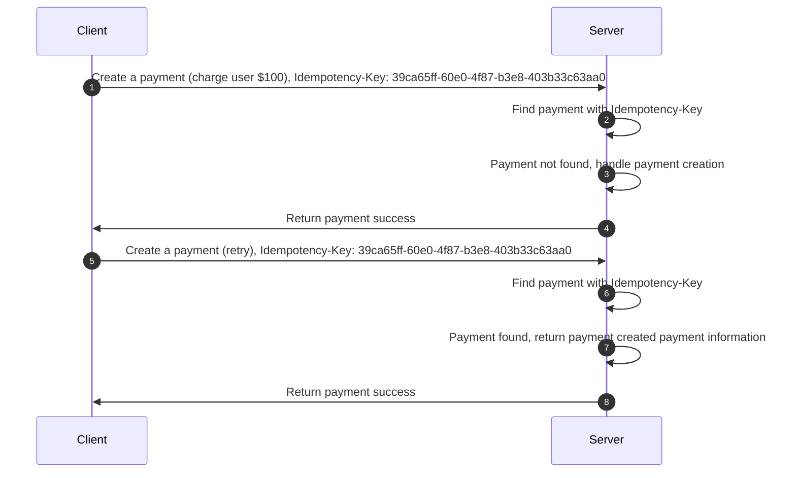

```mermaid
sequenceDiagram
    autonumber
    participant Client
    participant Server
    Client->>Server: Create a payment (charge user $100), Idempotency-Key: 39ca65ff-60e0-4f87-b3e8-403b33c63aa0
    Server->>Server: Find payment with Idempotency-Key
    Server->>Server: Payment not found, handle payment creation
    Server->>Client: Return payment success

    Client->>Server: Create a payment (retry), Idempotency-Key: 39ca65ff-60e0-4f87-b3e8-403b33c63aa0
    Server->>Server: Find payment with Idempotency-Key
    Server->>Server: Payment found, return payment created payment information
    Server->>Client: Return payment success
```